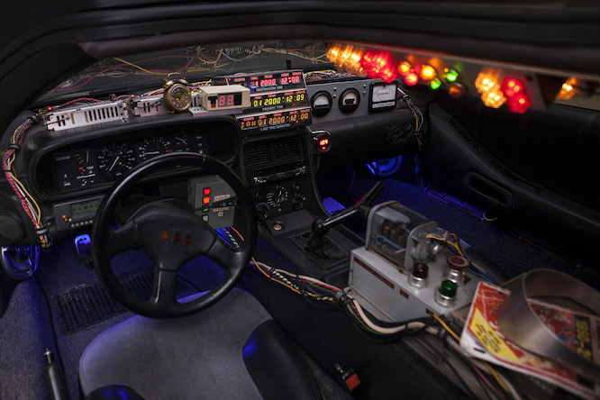

DeLorean
--------

Bringing your [Zsh][] config back to the future!

## Circuits



  1. [git][]
  2. [directory][]
  3. [homebrew][]
  4. [osx][]
  5. [utility][]
  6. [bower][]
  7. [filetype][]
  8. [internet][]
  9. [meteor][]
  10. [sublime][]
  11. [taskwarrior][]
  12. [url][]
  13. [vagrant][]
  14. [wordpress][]
  15. [macvim][]
  16. [pwsafe][]
  17. [fzf][]

DeLorean loads only the circuits that have been enabled in [`flux-capacitor.zsh`][].

### Themes

  1. [pure][]
  2. [sorin][]
  3. [powerlevel9k][]

License
-------

[](https://tldrlegal.com/l/mit)

Copyright (c) 2015-2016 Joel Kuzmarski.

Copyright (c) 2011-2015 Sorin Ionescu and contributors.

Copyright (c) 2009-2011 Robby Russell and contributors.

```DeLorean
   __---~~~~--__                      __--~~~~---__
  `\---~~~~~~~~\\                    //~~~~~~~~---/'
    \/~~~~~~~~~\||                  ||/~~~~~~~~~\/
                `\\                //'
                  `\\            //'
                    ||          ||      Hey Doc!
          ______--~~~~~~~~~~~~~~~~~~--______
     ___ // _-~                        ~-_ \\ ___
    `\__)\/~                              ~\/(__/'
     _--`-___                            ___-'--_
   /~     `\ ~~~~~~~~------------~~~~~~~~ /'     ~\
  /|        `\                          /'        |\
 | `\   ______`\_         DMC        _/'______   /' |
 |   `\_~-_____\ ~-________________-~ /_____-~_/'   |
 `.     ~-__________________________________-~     .'
  `.      [_______/------|~~|------\_______]      .'
   `\--___((____)(________\/________)(____))___--/'
    |>>>>>>||                            ||<<<<<<|
    `\<<<<</'                            `\>>>>>/'

    Now, if my calculations are correct,
    when this baby hits 88 miles an hour,
    you're going to see some serious shit!
```

Thanks to [@spcmd][] for the DeLorean ascii art.

[Zsh]: http://www.zsh.org
[git]: ZDOTDIR/circuits/git
[directory]: ZDOTDIR/circuits/directory
[homebrew]: ZDOTDIR/circuits/homebrew
[osx]: ZDOTDIR/circuits/osx
[utility]: ZDOTDIR/circuits/utility
[bower]: ZDOTDIR/circuits/bower
[filetype]: ZDOTDIR/circuits/filetype
[internet]: ZDOTDIR/circuits/internet
[meteor]: ZDOTDIR/circuits/meteor
[sublime]: ZDOTDIR/circuits/sublime
[taskwarrior]: ZDOTDIR/circuits/taskwarrior
[url]: ZDOTDIR/circuits/url
[vagrant]: ZDOTDIR/circuits/vagrant
[wordpress]: ZDOTDIR/circuits/wordpress
[macvim]: ZDOTDIR/circuits/macvim
[pwsafe]: ZDOTDIR/circuits/pwsafe
[fzf]: ZDOTDIR/circuits/fzf
[`flux-capacitor.zsh`]: ZDOTDIR/flux-capacitor.zsh 
[pure]: ZDOTDIR/circuits/prompt
[sorin]: ZDOTDIR/circuits/prompt
[powerlevel9k]: ZDOTDIR/circuits/prompt
[@spcmd]: https://github.com/spcmd
